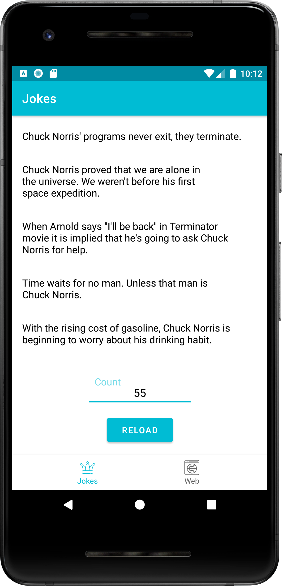
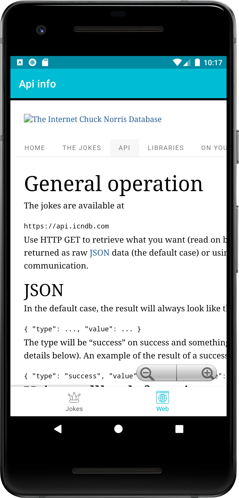
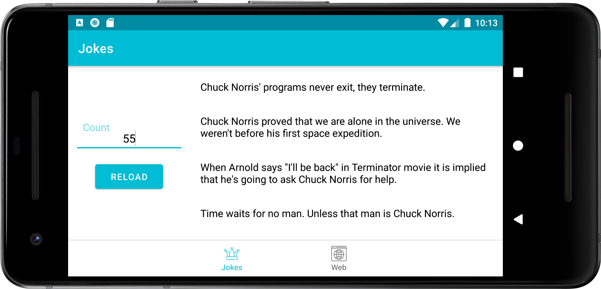

# Jokes

My solution of the test task from a company

The task:

General information:
- Mobile application for android
- Minimum version - 21 API
- Development language - preferably Kotlin
- Development environment - best of all Android Studio
- Any use of frameworks is allowed
- Design customization is allowed, it is required to keep the general concept of application

App Description:

Mobile app with jokes about Chuck Norris. 

There is a navigation menu and two tabs. 

In the first, the user enters the desired number of jokes at the bottom of the screen, presses the RELOAD button. 

Chuck Norris jokes are loaded from the server to the list at the top of the screen.

On the second tab is the browser with a link to the API documentation.

The advantages will be:
- Using popular frameworks for working with the server
- Clean and readable code using SOLID
- Save loaded jokes when you rotate the screen
- Save WebView state on screen rotation

Additional Information:
- Link to documentation - http://www.icndb.com/api/

Will be a plus the ability to navigate the system back button and save the state of the webview when the screen is rotated.

 

